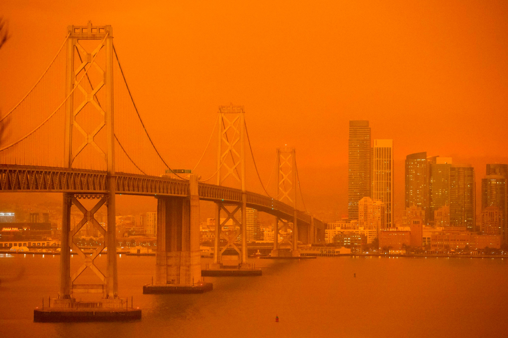
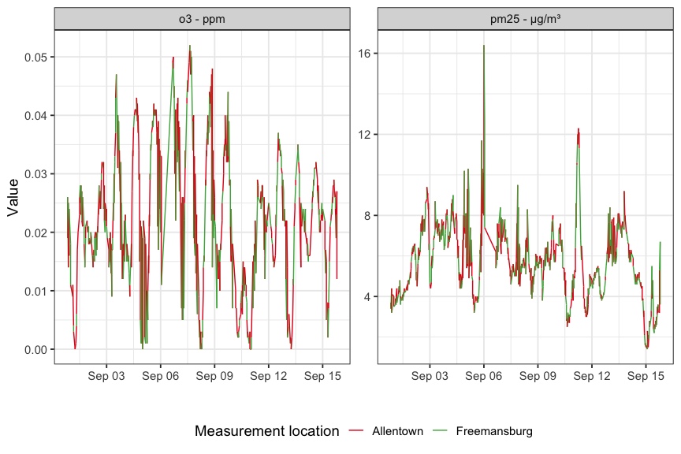

<!-- README.md is generated from README.Rmd. Please edit that file -->

# STA 323 & 523 :: Exam 01

## Introduction

<center>



</center>

*Source*:
<https://www.standard.co.uk/news/world/california-wildfire-orange-sky-san-francisco-a4544106.html>

<br/>

In September, wildfires were raging and racing across parts of the U.S.
west coast. The quantity and intensity of the fires had resulted in some
apocalyptic images (as seen above) in San Francisco, Portland, and
Idaho. The smoke from these storms was pushed as far east as
Pennsylvania. In addition to the destruction caused by the fires, they
also severely impacted the air quality, in and around their epicenters.
In this exam you will investigate and analyze air quality data near and
far from the west coast wildfires.

## Data

Data in your repository contains air quality measurements from three
regions (San Francisco-Oakland-Fremont, Portland-Vancouver-Beaverton,
and Allentown-Bethlehem-Easton) over a 15-day period, beginning
September 1, 2020 UTC time. Measurements are recorded for various
quantities (parameters) of interest at multiple times and locations
within each region.

To get started, read in `air_quality.rds` and create an object named
`air_quality` with the below code. This code is given in your starter
Rmd file.

``` r
air_quality <- readRDS(file = "data/air_quality.rds")
```

Most of the variables are self-explanatory. However, it may be helpful
to do some background research on the various parameters in order to
create more insightful visualizations and produce more interesting
results.

## Part I

#### Task 1

Suppose you work for the EPA and this is your initial pull of the data
from a database. You know your manager will ask you to pull more data
from the same source that includes any number of regions and dates.
Since the data comes from the same source, the structure will be
identical to what you have in your small initial pull.

Your goal is to unpack the list, `air_quality`, into a tidy tibble
called `aq`. In doing this, you should write code that will work
regardless of how many and which U.S. regions and their dates the data
contains. This way you will be able to use your same code in the future
and quickly process your manager’s request.

To complete this task, you may use any functions or loops to unpack the
list into a tidy tibble. The points allocated for this part will be
based on having correct code, having code that is robust to a different
dataset as mentioned above, and having code that is efficient. In this
setting, using functionals is considered more efficient than writing
loops. A large majority of the points will be allocated to the first two
components; do not get bogged down on the third component (efficiency)
to the point where it prevents you from completing Part II.

Below is a rough guide of the steps you should take to ensure you get a
tidy tibble in the correct format. Depending on how you unpack the list,
your steps may differ slightly.

1.  Unpack the list so it is a tibble that contains the location,
    parameter, utc date, local date, value, unit, latitude, longitude,
    country, and city. None of the `meta` information is needed.

2.  Fix the variable names for a consistent syntax and rename city as
    region.

3.  Fill in any missing values if they exist. Your final tibble should
    not have any `NA` values present.

4.  Value, latitude, and longitude should all be numeric.

5.  Parse each of the local and utc date variables to create new
    variables based on the year, month, day, and hour. Follow a
    consistent variable naming scheme. Hint: `lubridate` functions
    `month()`, `day()`, `year()`, `hour()`, etc. will make this very
    easy. There are other ways and using `lubridate` is not required.

6.  Check that the object in `data/aq_clean.rds` matches your tibble
    exactly. You can read it in with `read_rds()`.

For grading purposes, please export your tidy tibble to the results
folder in your repo with the following code.

``` r
saveRDS(object = aq, file = "results/task_1.rds")
```

## Part II

Your manager isn’t sure what analysis should be done yet, so you decide
to explore the data some yourself.

For this part, you may code your answers specific to the regions and
dates in `aq`. Use `aq` to complete the rest of the tasks, using
`tidyverse` functions when applicable. If you were unable to complete
Part I, you may use the object `aq_clean.rds` in `data/`.

#### Task 2

How many locations within each region took air quality measurements?

#### Task 3

What were the IQR, mean, and median values of `pm25` in each region
based on measurements taken in the first seven days of September
(according to the UTC date)?

#### Task 4

Find the location in the San Francisco region with the biggest gap in
the proportion of measurements taken in the first 12 hours of the day
versus the last 12 hours of the day. Use the local time.

#### Task 5

Consider the five locations in the “Portland-Vancouver-Beaverton” region
with the most measurements taken for parameter `pm25`. For those
locations, compute mean and median `pm25` values for each three-day
period starting with September 1 - 3 and ending with September 13 - 15
(according to the local date). You should have a total of five three-day
blocks. Sort the result chronologically.

#### Task 6

Recreate the figure below using functions from `ggplot2`. Some
information you will need:

  - the date is the local date;
  - date breaks is `"3 days"` and the date labels are `"%b %d"`;
  - the colors are `"#e41a1c"` and `"#4daf4a"`;
  - the figure width is 9 and the figure height is 6;
  - patchwork is not used here;
  - the theme is `bw` with a font base size of 14.

<!-- -->

#### Task 7

Construct a single visualization using `ggplot2`, or any extension
packages related to `ggplot2`, that depicts something about the air
quality data. A single visualization can include subplots via faceting
or patchwork, but I do not want, for example, 10 unrelated graphics.
Your visualization should be well-polished with a title that tells a
story; aesthetics, font size, and style should be carefully considered.
You may construct this visualization with the mindset that it would
appear in a presentation. A visualization that is simple, but correct,
will earn some of the points for this task. Only correct visualizations
that go above-and-beyond the basics will earn full credit. This does not
mean you have to do an animation or create an interactive graphic.

## Essential details

### Deadline and submission

**The deadline to submit Exam 01 is Wednesday, February 24 at 11:59pm
ET.** Only the code in your main branch will be graded. You are not
required to create any additional branches for this individual exam.

### Rules

**Phase I**: Data understanding, Friday, February 19 at 5:00pm - Monday,
February 22 at 10:00am ET

**Phase II**: Tasks, Monday, February 22 at 10:00am - Wednesday,
February 24 at 11:59pm ET

  - This is an individual assignment.

  - Everything in your repository is for your eyes only except for the
    instructor and TAs.

  - You may not communicate anything about this exam to anyone. This
    includes posting or interacting in any online forums.

  - You may read and reference any resources. As always, you must cite
    any code you use as inspiration that is beyond what we introduced
    thus far in the course.

  - For any questions, send a direct message on Slack (or email) to the
    instructor. Questions should only be about understanding the data or
    the exam’s instructions.

### Academic integrity

To uphold the Duke Community Standard:

  - I will not lie, cheat, or steal in my academic endeavors;
  - I will conduct myself honorably in all my endeavors; and
  - I will act if the Standard is compromised.

Duke University is a community dedicated to scholarship, leadership, and
service and to the principles of honesty, fairness, respect, and
accountability. Citizens of this community commit to reflect upon and
uphold these principles in all academic and non-academic endeavors, and
to protect and promote a culture of integrity. Cheating on exams and
quizzes, plagiarism on homework assignments and projects, lying about an
illness or absence and other forms of academic dishonesty are a breach
of trust with classmates and faculty, violate the Duke Community
Standard, and will not be tolerated. Such incidences will result in a 0
grade for all parties involved as well as being reported to the
University Judicial Board. Additionally, there may be penalties to your
final class grade. Please review Duke’s Standards of Conduct.

### Grading

| **Topic** | **Points** |
| --------- | ---------- |
| Task 1    | 24         |
| Task 2    | 2          |
| Task 3    | 3          |
| Task 4    | 5          |
| Task 5    | 6          |
| Task 6    | 8          |
| Task 7    | 12         |
| **Total** | **60**     |

*Within each task a portion of the points will be allocated to
efficiency and code style.*

*Documents that fail to knit after minimal intervention will receive a
0*.
